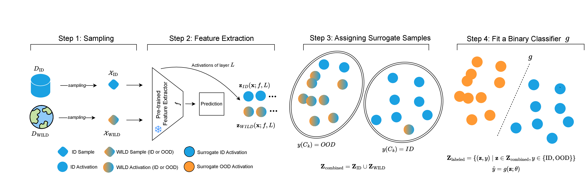
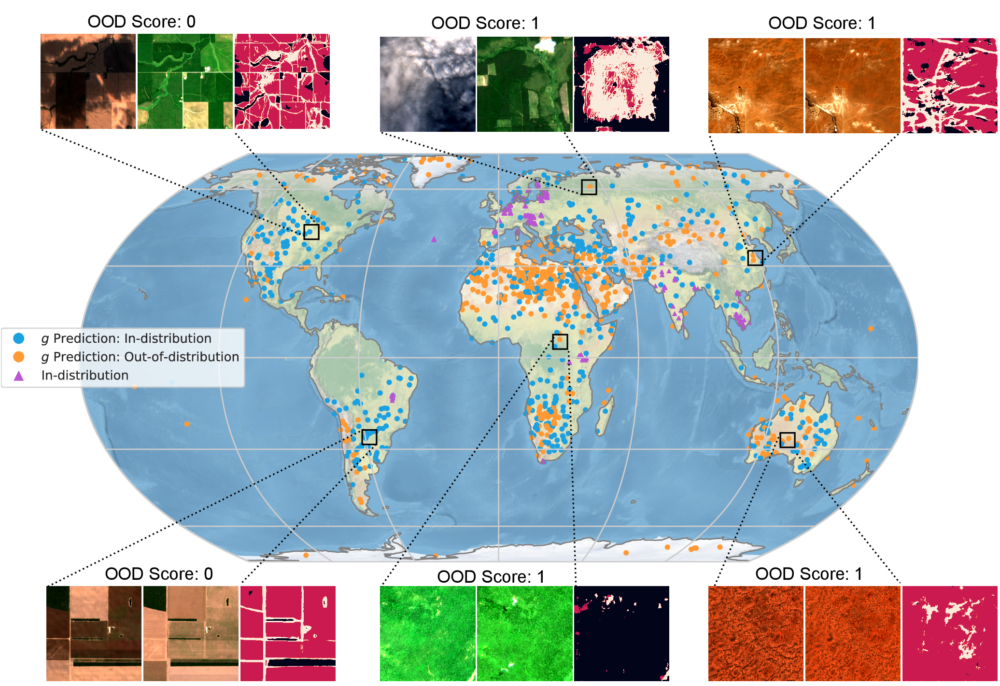

# Distribution Shifts at Scale: Out-of-distribution Detection in Earth Observation
  
*TARDIS consists of four key steps:*  
*1. Sampling in-distribution (ID) and WILD samples.*  
*2. Extracting internal activations from a pre-trained model \( f \) for both ID and WILD samples.*  
*3. Clustering the combined feature space and labeling WILD samples as surrogate-ID or surrogate-OOD.*  
*4. Fitting a binary classifier \( g \) on the labeled feature representations to distinguish between ID and OOD samples. The classifier, during deployment, flags out-of-distribution inputs.*

## Approach 
TARDIS is a post-hoc OOD detection method designed for scalable geospatial deployments. It works by extracting internal activations from a pre-trained model, clustering the feature space, and assigning surrogate labels to WILD samples as either in-distribution (ID) or out-of-distribution (OOD). These surrogate labels are then used to train a binary classifier, enabling OOD detection during inference without compromising the model's primary task performance. The method is computationally efficient, making it practical for large-scale real-world deployments. For more details, check out our [paper](TBP).

## Overview
We first demonstrate our method on two datasets, _EuroSAT_ and _xBD_, under 17 experimental setups involving covariate and semantic shifts. This is implemented in `notebooks/eurosat_exp.ipynb` and `notebooks/xbd_exp.ipynb`, with the corresponding code in `src/tardis/`.  

Then, we scale up the method for real-world deployment using a model trained on the [Fields of the World (FTW) dataset](https://github.com/fieldsoftheworld). This is demonstrated in `notebooks/tardis_FTW.ipynb`, with the corresponding code in `src/tardis_ftw/`.

We assume access to a pre-trained model, its training set, and a collection of data with an unknown distribution (either ID or OOD). Here is how our method works:

```python
from src.tardis_ftw.tardis_wrapper import TARDISWrapper

ood_model = TARDISWrapper(
    base_model,              # The pre-trained model to investigate
    hook_layer_name,         # The layer name from which activations are extracted
    id_loader,               # DataLoader for in-distribution (ID) samples
    wild_loader,             # DataLoader for WILD samples with unknown distributions (ID or OOD)
    num_clusters,            # Number of clusters for K-Means clustering in activation space
    id_ratio,                # Threshold for determining surrogate-ID or surrogate-OOD labels based on ID sample ratio in a cluster
    classifier_save_path,    # Path to save the trained binary classifier
)

# Step 1: Extract internal features
X, y = ood_model.compute_features()

# Step 2: Cluster the feature space
y_clustered = ood_model.feature_space_clustering(X, y)

# Step 3: Train the binary OOD classifier
metrics = ood_model.g_classification(X, y_clustered)

# Step 4: Deploy the binary OOD classifier as a wrapper around the model
f_preds, g_pred_probs = ood_model.f_g_prediction(inference_images)

# `f_preds`: The predictions of the  model (`base_model`).  
# `g_pred_probs`: Probability scores of the binary classifier, where **0** indicates higher ID characteristics and **1** indicates stronger OOD characteristics.
```

<!-- Below is the complete repository structure: -->
<!-- 
```
configs/
├── eurosat/                  # Configuration files for experiments on the EuroSAT dataset.
├── xview/                    # Configuration files for experiments on the xView dataset.

notebooks/
├── eurosat_exp.ipynb         # Example notebook for running experiments on the EuroSAT dataset.
├── tardis_FTW.ipynb          # Notebook demonstrating TARDIS on the Fields of the World (FTW) dataset.
├── xview_exp.ipynb           # Example notebook for running experiments on the xView dataset.

src/
├── tardis/
│   ├── __init__.py           # Initialization file for the TARDIS module.
│   ├── eurosat_datamodule.py # Handles EuroSAT dataset loading and preprocessing.
│   ├── eurosat_main.py       # Main script for running experiments on the EuroSAT dataset.
│   ├── eurosat_xview_utils.py# Helper functions for EuroSAT and xView datasets.
│   ├── ood_classifier.py     # Script to train the binary classifier for OOD detection.
│   ├── utils.py              # General utility functions for TARDIS.
│   ├── xview2_datamodule.py  # Handles xView dataset loading and preprocessing.
│   ├── xview2_main.py        # Main script for running experiments on the xView dataset.

├── tardis_ftw/
│   ├── __init__.py           # Initialization file for TARDIS-specific modules.
│   ├── config.yaml           # YAML file specifying parameters for TARDIS experiments.
│   ├── custom_trainer.py     # Custom training script for TARDIS experiments.
│   ├── data_utils.py         # Data utility functions for preprocessing Sentinel-2 data.
│   ├── sample_s2_pc.py       # Script for sampling Sentinel-2 data from Planetary Computer.
│   ├── tardis_wrapper.py     # Core wrapper implementing TARDIS workflow.
│   ├── utils.py              # Additional helper functions for TARDIS.
``` -->

## OOD Detection Goes Global: TARDIS in Action

*The figure illustrates the geographical distribution of ID and WILD samples, where WILD samples are classified by the domain shift classifier as either ID or OOD. For randomly sampled Sentinel-2 input pairs, the model predictions and classifier outputs are shown. Notably, poor model predictions often correspond to high OOD detection performance, with a geographical pattern emerging: samples from arid biomes (e.g., the Sahara, Patagonia, Inner Australia) and polar regions (e.g., Icelandic glaciers, South Pole) are frequently flagged as OOD due to their ecological dissimilarity to mesic environments represented in the ID samples.*

## Citation
```bibtex
@misc{ekim2024distributionshiftsscaleoutofdistribution,
      title={Distribution Shifts at Scale: Out-of-distribution Detection in Earth Observation}, 
      author={Burak Ekim and Girmaw Abebe Tadesse and Caleb Robinson and Gilles Hacheme and Michael Schmitt and Rahul Dodhia and Juan M. Lavista Ferres},
      year={2024},
      eprint={2412.13394},
      archivePrefix={arXiv},
      primaryClass={cs.CV},
      url={https://arxiv.org/abs/2412.13394}, 
}
```

<!-- 
# Project

> This repo has been populated by an initial template to help get you started. Please
> make sure to update the content to build a great experience for community-building.

As the maintainer of this project, please make a few updates:

- Improving this README.MD file to provide a great experience
- Updating SUPPORT.MD with content about this project's support experience
- Understanding the security reporting process in SECURITY.MD
- Remove this section from the README -->

## Contributing

This project welcomes contributions and suggestions.  Most contributions require you to agree to a
Contributor License Agreement (CLA) declaring that you have the right to, and actually do, grant us
the rights to use your contribution. For details, visit https://cla.opensource.microsoft.com.

When you submit a pull request, a CLA bot will automatically determine whether you need to provide
a CLA and decorate the PR appropriately (e.g., status check, comment). Simply follow the instructions
provided by the bot. You will only need to do this once across all repos using our CLA.

This project has adopted the [Microsoft Open Source Code of Conduct](https://opensource.microsoft.com/codeofconduct/).
For more information see the [Code of Conduct FAQ](https://opensource.microsoft.com/codeofconduct/faq/) or
contact [opencode@microsoft.com](mailto:opencode@microsoft.com) with any additional questions or comments.

## Trademarks

This project may contain trademarks or logos for projects, products, or services. Authorized use of Microsoft 
trademarks or logos is subject to and must follow 
[Microsoft's Trademark & Brand Guidelines](https://www.microsoft.com/en-us/legal/intellectualproperty/trademarks/usage/general).
Use of Microsoft trademarks or logos in modified versions of this project must not cause confusion or imply Microsoft sponsorship.
Any use of third-party trademarks or logos are subject to those third-party's policies.
